R Project
==============
---
#### Author: Ivan Inđić
#### Date: 26.09.2020
#### Title: Dataset on positive mental health of Indonesian, Malaysian, and Thailand university  students 
#### Reference: [ScienceDirect](https://www.sciencedirect.com/science/article/pii/S2352340920312087#ecom0001) 
---
### Task 1.

First step would be to load **packages** that we will be using.  
```
library("readxl")
library("plyr")
library("xtable")
library("htmlTable")
library("Hmisc")
library("agricolae")
library("equaltestMI")
library("semTools")
library("semPlot")
library("FSA")
library("dunn.test")

```

After this we need to load data into **dataframes** and do some filtering because of some NA's that are present.

```
indonesia <- read_xlsx("/home/ivan/Downloads/ScienceDirect_files_17Sep2020_12-27-43.137/1-s2.0-S2352340920312087-mmc4.xlsx", sheet = "INDONESIA")
malaysia <- read_xlsx("/home/ivan/Downloads/ScienceDirect_files_17Sep2020_12-27-43.137/1-s2.0-S2352340920312087-mmc4.xlsx", sheet="MALAYSIA")
thailand <- read_xlsx("/home/ivan/Downloads/ScienceDirect_files_17Sep2020_12-27-43.137/1-s2.0-S2352340920312087-mmc4.xlsx", sheet="THAILAND")
indonesia <- indonesia[1:331,]
malaysia <- malaysia[1:320,]
indonesia["country"] <- "Indonesia"
malaysia["country"] <- "Malaysia"
thailand["country"] <- "Thailand"
names(malaysia)[names(malaysia)== "FTotal"] <- "Ftotal"
names(malaysia)[names(malaysia)== "ETotal"] <- "Etotal"
indonesia$GENDER[indonesia$GENDER=="Perempuan"] <- "F"
indonesia$GENDER[indonesia$GENDER=="Laki-laki"] <- "M"
malaysia$GENDER[malaysia$GENDER=="PEREMPUAN"] <- "F"
malaysia$GENDER[malaysia$GENDER=="LELAKI"] <- "M"
thailand$GENDER[thailand$GENDER=="Perempuan"] <- "F"
thailand$GENDER[thailand$GENDER=="Laki-laki"] <- "M"
thailand$GENDER[thailand$GENDER=="waria" | thailand$GENDER=="Waria"] <- "Other"
thailand$GENDER[thailand$GENDER=="laki-laki"] <- "M"

```
Now we can calculate number of students per **gender** and **age**.

First we will be using full dataset.

```
gender.total <- matrix(c(nrow(total[total$GENDER=="F", ]), nrow(total[total$GENDER=="F", ])/nrow(total),nrow(total[total$GENDER=="M", ]), nrow(total[total$GENDER=="M", ])/nrow(total), nrow(total[total$GENDER=="Other", ]), nrow(total[total$GENDER=="Other", ])/nrow(total), nrow(total), 1), ncol = 2, byrow = TRUE)
colnames(gender.total) <- c("Frequency", "Percent")
rownames(gender.total) <- c("Female","Male", "Other", "Total")


age.total <- matrix(c(nrow(total[total$Age <= 17, ]), nrow(total[total$Age <= 17, ])/nrow(total), nrow(total[total$Age >= 18 & total$Age <= 20, ]), nrow(total[total$Age >= 18 & total$Age <= 20, ])/nrow(total),nrow(total[total$Age >= 21 & total$Age <= 23, ]), nrow(total[total$Age >= 21 & total$Age <= 23, ])/nrow(total), nrow(total[total$Age >= 24 & total$Age <= 26, ]), nrow(total[total$Age >= 24 & total$Age <= 26, ])/nrow(total), nrow(total[total$Age >= 27 & total$Age <= 29, ]), nrow(total[total$Age >= 27 & total$Age <= 29, ])/nrow(total), nrow(total[total$Age >= 30, ]), nrow(total[total$Age >= 30, ])/nrow(total), nrow(total), 1), ncol = 2, byrow = TRUE)
colnames(age.total) <-  c("Frequency", "Percent")
rownames(age.total) <- c("17 or less", "18-20","21-23","24-26","27-29", "30 or more", "Total")

```
---

| Gender   |  Frequency  |   Percent   |
| -------- | ----------- | ----------- |
|Female    |   605 | 0.624355005
|Male      |   355 | 0.366357069
|Other     |     9 | 0.009287926
|Total     |   969 | 1.000000000

---

|Age       |  Frequency  |   Percent   |
| -------- | ----------- | ----------- |
|17 or less     |    5   | 0.005159959
|18-20          |  497   | 0.512899897
|21-23          |  406   | 0.418988648
|24-26          |   60   | 0.061919505
|27-29          |    0   | 0.000000000
|30 or more     |    1   | 0.001031992
|Total          |  969   | 1.000000000

---

Now, same calculations but only for Indonesia.

```
gender.indonesia <- matrix(c(nrow(indonesia[indonesia$GENDER=="F", ]), nrow(indonesia[indonesia$GENDER=="F", ])/nrow(indonesia),nrow(indonesia[indonesia$GENDER!="F", ]), nrow(indonesia[indonesia$GENDER!="F", ])/nrow(indonesia), nrow(indonesia), 1), ncol = 2, byrow = TRUE)
colnames(gender.indonesia) <- c("Frequency", "Percent")
rownames(gender.indonesia) <- c("Female","Male", "Total")


age.indonesia <- matrix(c(nrow(indonesia[indonesia$Age <= 17, ]), nrow(indonesia[indonesia$Age <= 17, ])/nrow(indonesia), nrow(indonesia[indonesia$Age >= 18 & indonesia$Age <= 20, ]), nrow(indonesia[indonesia$Age >= 18 & indonesia$Age <= 20, ])/nrow(indonesia),nrow(indonesia[indonesia$Age >= 21 & indonesia$Age <= 23, ]), nrow(indonesia[indonesia$Age >= 21 & indonesia$Age <= 23, ])/nrow(indonesia), nrow(indonesia[indonesia$Age >= 24 & indonesia$Age <= 26, ]), nrow(indonesia[indonesia$Age >= 24 & indonesia$Age <= 26, ])/nrow(indonesia), nrow(indonesia[indonesia$Age >= 27 & indonesia$Age <= 29, ]), nrow(indonesia[indonesia$Age >= 27 & indonesia$Age <= 29, ])/nrow(indonesia), nrow(indonesia[indonesia$Age >= 30, ]), nrow(indonesia[indonesia$Age >= 30, ])/nrow(indonesia), nrow(indonesia), 1), ncol = 2, byrow = TRUE)
colnames(age.indonesia) <- c("Frequency", "Percent")
rownames(age.indonesia) <- c("17 or less", "18-20","21-23","24-26","27-29", "30 or more", "Total")
```
---

|Gender    |Frequency    | Percent     |
| -------- | ----------- | ----------- |
|Female    |     189     |   0.570997
|Male      |     142     |   0.429003
|Total     |     331     |   1.000000

---

|    Age      | Frequency |  Percent|
| -------- | ----------- | ----------- |
|17 or less   |         3 | 0.009063444
|18-20        |       239 |0.722054381
|21-23        |        87 | 0.262839879
|24-26        |         1 | 0.003021148
|27-29        |         0 | 0.000000000
|30 or more   |         1 | 0.003021148
|Total        |       331 | 1.000000000

---

Now for Malaysia.

```
gender.malaysia <- matrix(c(nrow(malaysia[malaysia$GENDER=="F", ]), nrow(malaysia[malaysia$GENDER=="F", ])/nrow(malaysia),nrow(malaysia[malaysia$GENDER!="F", ]), nrow(malaysia[malaysia$GENDER!="F", ])/nrow(malaysia), nrow(malaysia), 1), ncol = 2, byrow = TRUE)
colnames(gender.malaysia) <- c("Frequency", "Percent")
rownames(gender.malaysia) <- c("Female","Male", "Total")


age.malaysia <- matrix(c(nrow(malaysia[malaysia$Age <= 17, ]), nrow(malaysia[malaysia$Age <= 17, ])/nrow(malaysia), nrow(malaysia[malaysia$Age >= 18 & malaysia$Age <= 20, ]), nrow(malaysia[malaysia$Age >= 18 & malaysia$Age <= 20, ])/nrow(malaysia),nrow(malaysia[malaysia$Age >= 21 & malaysia$Age <= 23, ]), nrow(malaysia[malaysia$Age >= 21 & malaysia$Age <= 23, ])/nrow(malaysia), nrow(malaysia[malaysia$Age >= 24 & malaysia$Age <= 26, ]), nrow(malaysia[malaysia$Age >= 24 & malaysia$Age <= 26, ])/nrow(malaysia), nrow(malaysia[malaysia$Age >= 27 & malaysia$Age <= 29, ]), nrow(malaysia[malaysia$Age >= 27 & malaysia$Age <= 29, ])/nrow(malaysia), nrow(malaysia[malaysia$Age >= 30, ]), nrow(malaysia[malaysia$Age >= 30, ])/nrow(malaysia), nrow(malaysia), 1), ncol = 2, byrow = TRUE)
colnames(age.malaysia) <-  c("Frequency", "Percent")
rownames(age.malaysia) <- c("17 or less", "18-20","21-23","24-26","27-29", "30 or more", "Total"
```

---

| Gender   |  Frequency  |   Percent
| -------- | ----------- | ----------- |
|Female    |      172    |    0.5375
|Male      |      148    |    0.4625
|Total     |      320    |    1.0000

---

|   Age     |   Frequency |  Percent
| -------- | ----------- | ----------- |
|17 or less    |    0 | 0.000000
|18-20         |   32 |0.100000
|21-23         |  229 |0.715625
|24-26         |   59 |0.184375
|27-29         |    0 |0.000000
|30 or more    |    0 |0.000000
|Total         |  320 |1.000000

---

Now, graphical view of those calculations.

```
par(mfrow=c(2,2))

barplot(malaysia.age, ylim = c(0,150), main = "Age frequency [malaysia]", ylab = "Frequency", xlab = "Age")
barplot(indonesia.age, ylim = c(0,150), main = "Age frequency [Indonesia]", ylab = "Frequency", xlab = "Age")
barplot(thailand.age, ylim = c(0,150), main = "Age frequency [Thailand]", ylab = "Frequency", xlab = "Age")
barplot(total.age, ylim = c(0,300), main = "Age frequency [total]", ylab = "Frequency", xlab = "Age")


barplot(malaysia.gender, main = "Gender frequency [malaysia]", ylim = c(0,200), ylab = "Frequency", xlab = "Gender")
barplot(indonesia.gender, main = "Gender frequency [Indonesia]", ylim = c(0,200), ylab = "Frequency", xlab = "Gender")
barplot(thailand.gender, main = "Gender frequency [Thailand]", ylim = c(0,300), ylab = "Frequency", xlab = "Gender")
barplot(total.gender, main = "Gender frequency [total]", ylim = c(0,650), ylab = "Frequency", xlab = "Gender")
```


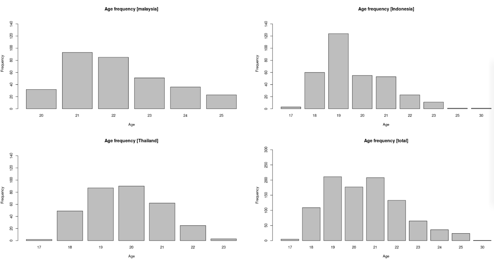
---
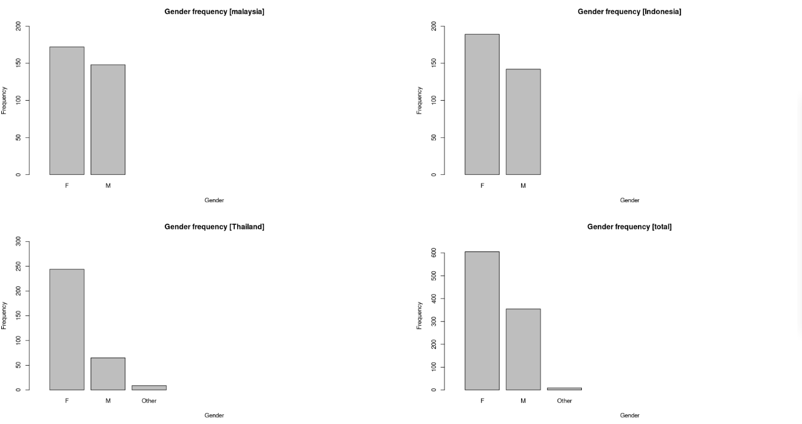
---

### Task 2. Basic descriptive statistics
##### In this task we need to calculate basic descriptive statistics for every catergory we have. Our categories are Positive Mental Health,Subjective Happiness, Forgiveness, Humility and Information Literacy Self Efficacy. For this task we'll be using **summary**, **var** and **sd** functions.

```
columns <- c("Etotal","Ctotal","Dtotal","Ftotal","Gtotal")
total.total <- total[ ,columns]
colnames(total.total) <- c ("Positive Mental Health", "Subjective Happiness", "Forgiveness", "Humility", "Information Literacy Self Efficacy")

total.descriptive <- matrix(nrow = 5,c(sapply(total.total, FUN = max),sapply(total.total, FUN = min),sapply(total.total, FUN = mean),sapply(total.total, FUN = sd),sapply(total.total, FUN = var)))
colnames(total.descriptive) <- c("Maximum", "Minimum", "Mean", "Sd", "Variance")
rownames(total.descriptive) <- c("Positive Mental Health", "Subjective Happiness", "Forgiveness", "Humility", "Information Literacy Self Efficacy")
total.descriptive

total.indonesia <- indonesia[ ,columns]
colnames(total.indonesia)  <- c ("Positive Mental Health", "Subjective Happiness", "Forgiveness", "Humility", "Information Literacy Self Efficacy")
indonesia.descriptive <-  matrix(nrow = 5,c(sapply(total.indonesia, FUN = max),sapply(total.indonesia, FUN = min),sapply(total.indonesia, FUN = mean),sapply(total.indonesia, FUN = sd),sapply(total.indonesia, FUN = var)))
colnames(indonesia.descriptive) <- c("Maximum", "Minimum", "Mean", "Sd", "Variance")
rownames(indonesia.descriptive) <- c("Positive Mental Health", "Subjective Happiness", "Forgiveness", "Humility", "Information Literacy Self Efficacy")
indonesia.descriptive

total.malaysia <- malaysia[ ,columns]
colnames(total.malaysia)  <- c ("Positive Mental Health", "Subjective Happiness", "Forgiveness", "Humility", "Information Literacy Self Efficacy")
malaysia.descriptive <-  matrix(nrow = 5,c(sapply(total.malaysia, FUN = max),sapply(total.malaysia, FUN = min),sapply(total.malaysia, FUN = mean),sapply(total.malaysia, FUN = sd),sapply(total.malaysia, FUN = var)))
colnames(malaysia.descriptive) <- c("Maximum", "Minimum", "Mean", "Sd", "Variance")
rownames(malaysia.descriptive) <- c("Positive Mental Health", "Subjective Happiness", "Forgiveness", "Humility", "Information Literacy Self Efficacy")
malaysia.descriptive

total.thailand <- thailand[ ,columns]
colnames(total.thailand)  <- c ("Positive Mental Health", "Subjective Happiness", "Forgiveness", "Humility", "Information Literacy Self Efficacy")
thailand.descriptive <-  matrix(nrow = 5,c(sapply(total.thailand, FUN = max),sapply(total.thailand, FUN = min),sapply(total.thailand, FUN = mean),sapply(total.thailand, FUN = sd),sapply(total.thailand, FUN = var)))
colnames(thailand.descriptive) <- c("Maximum", "Minimum", "Mean", "Sd", "Variance")
rownames(thailand.descriptive) <- c("Positive Mental Health", "Subjective Happiness", "Forgiveness", "Humility", "Information Literacy Self Efficacy")
thailand.descriptive


par(mfrow=c(1,5))

hist(total.malaysia$`Positive Mental Health`, main="Positive mental health [Malaysia]", xlab= "Value", xlim = c(10,50), ylim = c(0, 140))
hist(total.malaysia$`Subjective Happiness`, main = "Subjective Happiness [Malaysia]", xlab = "Value", ylim = c(0,100), xlim=c(0,25))
hist(total.malaysia$Forgiveness, main = "Forgiveness [Malaysia]", ylim = c(0,100), xlab = "Value", xlim = c(20,100))
hist(total.malaysia$Humility, main = "Humility[Malaysia]", xlab = "Value", xlim = c(0,25), ylim = c(0,100))
hist(total.malaysia$`Information Literacy Self Efficacy`, main = "Information Literacy Self Efficacy[Malaysia]", xlab = "Value", ylim = c(0,120), xlim = c(30,90))

hist(total.indonesia$`Positive Mental Health`, main="Positive mental health [Indonesia]", xlab= "Value", xlim = c(0,50), ylim = c(0, 100))
hist(total.indonesia$`Subjective Happiness`, main = "Subjective Happiness [Indonesia]", xlab = "Value", ylim = c(0,100), xlim=c(0,25))
hist(total.indonesia$Forgiveness, main = "Forgiveness [Indonesia]", ylim = c(0,100), xlab = "Value", xlim = c(20,120))
hist(total.indonesia$Humility, main = "Humility[Indonesia]", xlab = "Value", xlim = c(5,25), ylim = c(0,60))
hist(total.indonesia$`Information Literacy Self Efficacy`, main = "Information Literacy Self Efficacy[Indonesia]", xlab = "Value", ylim = c(0,80), xlim = c(20,90))

hist(total.thailand$`Positive Mental Health`, main="Positive mental health [Thailand]", xlab= "Value", ylim = c(0,160))
hist(total.thailand$`Subjective Happiness`, main = "Subjective Happiness [Thailand]", xlab = "Value", ylim = c(0,70), xlim=c(0,25))
hist(total.thailand$Forgiveness, main = "Forgiveness [Thailand]", ylim = c(0,60), xlab = "Value", xlim = c(40,110))
hist(total.thailand$Humility, main = "Humility[Thailand]", xlab = "Value", xlim = c(5,25))
hist(total.thailand$`Information Literacy Self Efficacy`, main = "Information Literacy Self Efficacy[Thailand]", xlab = "Value", ylim = c(0,100), xlim = c(30,90))


hist(total.total$`Positive Mental Health`, main="Positive mental health [Total]", xlab= "Value", xlim = c(0,50), ylim = c(0,400))
hist(total.total$`Subjective Happiness`, main = "Subjective Happiness [Total]", xlab = "Value", ylim = c(0, 250), xlim=c(0,25))
hist(total.total$Forgiveness, main = "Forgiveness [Total]", ylim = c(0,250), xlab = "Value", xlim = c(20,120))
hist(total.total$Humility, main = "Humility[Total]", xlab = "Value", xlim = c(0,25), ylim = c(0,250))
hist(total.total$`Information Literacy Self Efficacy`, main = "Information Literacy Self Efficacy[Total]", xlab = "Value", ylim = c(0,300), xlim = c(20,90))


```

---


|   Variables (Total)                  	| Maximum 	| Minimum 	| Mean     	| Sd        	| Variance  	|
|------------------------------------	|---------	|---------	|----------	|-----------	|-----------	|
| Positive Mental Health             	| 45      	| 9       	| 33.66563 	| 5.644758  	| 31.86329  	|
| Subjective Happiness               	| 21      	| 4       	| 14.73787 	| 3.558168  	| 12.66056  	|
| Forgiveness                        	| 110     	| 24      	| 77.77812 	| 13.926063 	| 193.93522 	|
| Humility                           	| 21      	| 4       	| 14.68834 	| 3.383217  	| 11.44616  	|
| Information Literacy Self Efficacy 	| 85      	| 27      	| 63.77090 	| 8.079866  	| 65.28423  	|


---

|   Variables(Indonesia)            |Maximum      |Minimum |    Mean |       Sd|   Variance
|---------------------------------	|---------    |---------|----------	|-----------|-----------|
|Positive Mental Health             |     45      |      9 |34.51964 | 6.348615|  40.304916
|Subjective Happiness               |     21      |      5 |14.02417 | 3.272385|  10.708505
|Forgiveness                        |    110      |     35 |85.06949 |13.747882| 189.004248
|Humility                           |     21      |      9 |16.41994 | 2.606884|   6.795844
|Information Literacy Self Efficacy |     85      |     27 |63.12689 |10.472861| 109.680820

---

|    Variables(Malaysia)                |  Maximum  | Minimum|  Mean   |   Sd   | Variance
|---------------------------------	    |---------  |--------|---------|--------|-----------|
|Positive Mental Health                 |        45 |     13 |33.71250 |5.599359| 31.35282
|Subjective Happiness                   |        21 |      4 |16.22812 |3.691194| 13.62491
|Forgiveness                            |        88 |     24 |66.31875 |7.644837| 58.44353
|Humility                               |        21 |      4 |13.08437 |3.268891| 10.68565
|Information Literacy Self Efficacy     |        85 |     39 |64.80000 |5.801092| 33.65266

---

|   Varibles(Thailand)                     | Maximum | Minimum|   Mean  |     Sd   | Variance
|---------------------------------	       |-------- |--------|---------|--------  |-----------|
|Positive Mental Health                    | 45      |  14    |32.72956 | 4.706108 |22.14745
|Subjective Happiness                      | 21      |   5    |13.98113 | 3.233249 |10.45390
|Forgiveness                               |110      |  45    |81.72013 |11.531618 |132.97821
|Humility                                  | 21      |   6    |14.50000 | 3.370638 | 11.36120
|Information Literacy Self Efficacy        | 84      |  37    |63.40566 | 7.047981 | 49.67404

---


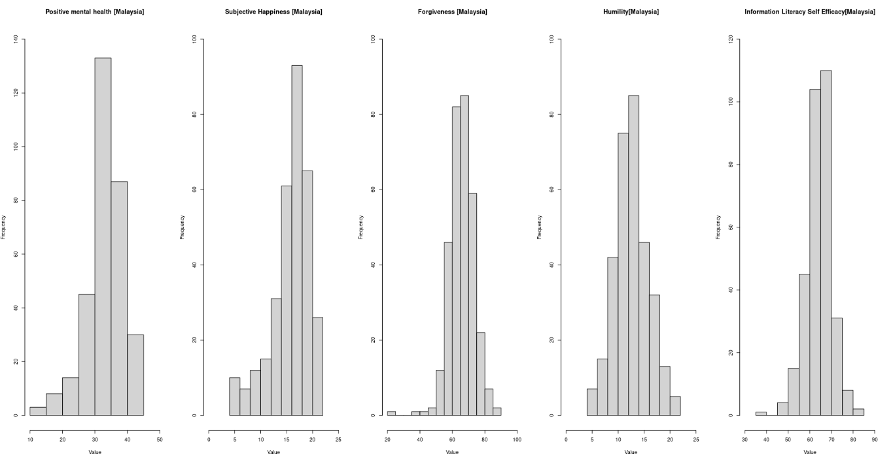

---

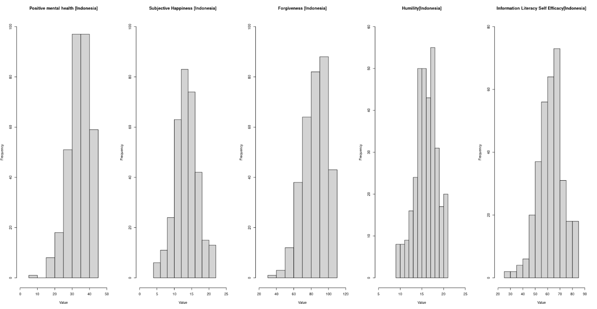

---

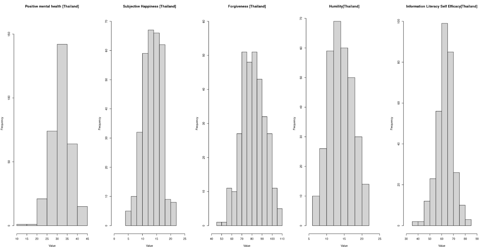

---

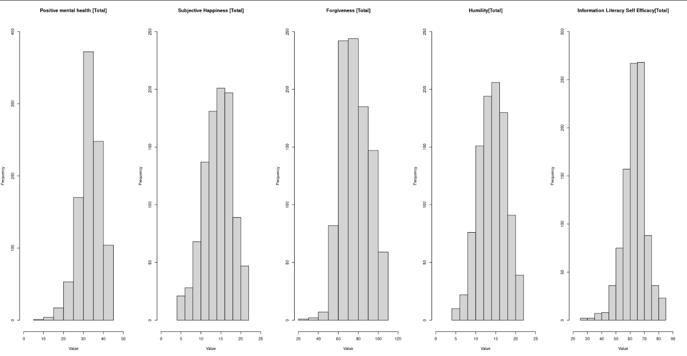


---
### Task3. Confirmatory factor analysis

#### Factors are the variables that experimenters control during an experiment in order to determine their effect on the response variable. A factor can take on only a small number of values, which are known as factor levels. Factors can be a categorical variable or based on a continuous variable but only use a limited number of values chosen by the experimenters. 
```
overall.model.full <- 'ILSE =~ G1 + G6 + G7 + G8 + G9 + G10 + G15 + G18 + G19 + G20 + G21 + G22 + G23 + G24 + G25 + G27 + G28; H =~ F4 + F5 + F6; PMH =~ E1 + E2
+ E3 + E4 + E5 + E6 + E7 + E8 + E9; F =~ D8 + D9 + D12 + D13 + D14 + D15 + D16 + D17 + D18 + D19 + D20 + D21 + D22 + D23 + D24 + D25; SH =~ C1 + C2 + C3'
overall.fit <- cfa(model = overall.model.full, data = total, meanstructure=TRUE, group = "country")
inspect(overall.fit,what="std")
summary(overall.fit, standardized = TRUE, rsquare = TRUE, fit.measure = TRUE)

```

|No|	Variable|	Items|	    Factor Loadings   |   |   |
|--| ---------  |--------|------------------------|---|----|
|  |      PMH  |              |  Malaysia  |Indonesia|	Thailand
|1 |           |        1     |      0.667 | 0.718   |  0.700
|  |           |        2     |      0.659 | 0.819   |  0.794
|  |           |        3     |      0.736 | 0.721   |  0.726
|  |           |        4     |      0.660 | 0.750   |  0.539
|  |           |        5     |      0.688 | 0.710   |  0.463
|  |           |        6     |      0.723 | 0.745   |  0.651
|  |           |        7     |      0.659 | 0.654   |  0.544
|  |           |        8     |      0.671 | 0.804   |  0.541
|  |           |        9     |      0.590 | 0.643   |  0.410
|  |      SH   |              |  Malaysia  |Indonesia|	Thailand
|2 |           |        1     |      0.852 | 0.765   |  0.595
|  |           |        2     |      0.823 | 0.734   |  0.782
|  |           |        3     |      0.652 | 0.639   |  0.831
|  |      F    |              |  Malaysia  |Indonesia|	Thailand
|3 |           |        1     |      0.488 | 0.368   |  0.540
|  |           |        2     |      0.490 | 0.322   |  0.559
|  |           |        3     |      0.373 | 0.235   |  0.593
|  |           |        4     |      0.389 | 0.305   |  0.588
|  |           |        5     |      0.347 | 0.345   |  0.521
|  |           |        6     |      0.545 | 0.631   |  0.509
|  |           |        7     |      0.647 | 0.795   |  0.626
|  |           |        8     |      0.608 | 0.702   |  0.557
|  |           |        9     |      0.661 | 0.870   |  0.668
|  |           |        10    |      0.622 | 0.771   |  0.604
|  |           |        11    |      0.517 | 0.694   |  0.587
|  |           |        12    |      0.664 | 0.806   |  0.689
|  |           |        13    |      0.510 | 0.455   |  0.373
|  |           |        14    |      0.460 | 0.372   |  0.259
|  |           |        15    |      0.418 | 0.420   |  0.317
|  |           |        16    |      0.286 | 0.324   |  0.354
|  |      H    |              |  Malaysia  |Indonesia|	Thailand
|4 |           |        1     |      0.853 | 0.745   |  0.793
|  |           |        2     |      0.721 | 0.858   |  0.769
|  |           |        3     |      0.244 | 0.625   |  0.463
|  |      ILSE |              |  Malaysia  |Indonesia|	Thailand
|5 |           |        1     |      0.312 | 0.486   |  0.245
|  |           |        2     |      0.137 | 0.625   |  0.394
|  |           |        3     |      0.142 | 0.399   |  0.304
|  |           |        4     |      0.426 | 0.541   |  0.227
|  |           |        5     |      0.404 | 0.555   |  0.227
|  |           |        6     |      0.438 | 0.591   |  0.280
|  |           |        7     |      0.136 | 0.530   |  0.440
|  |           |        8     |      0.284 | 0.622   |  0.466
|  |           |        9     |      0.226 | 0.611   |  0.282
|  |           |        10    |      0.395 | 0.668   |  0.486
|  |           |        11    |      0.505 | 0.699   |  0.540
|  |           |        12    |      0.611 | 0.830   |  0.827
|  |           |        13    |      0.675 | 0.842   |  0.856
|  |           |        14    |      0.639 | 0.808   |  0.794
|  |           |        15    |      0.415 | 0.708   |  0.722
|  |           |        16    |      0.126 | 0.633   |  0.450
|  |           |        17    |      0.065 | 0.606   |  0.386

---

### Root Mean Square Error of Approximation:

###  RMSEA                                          0.081

#### From this we can see that our hypothesized model is mediocre. 
---

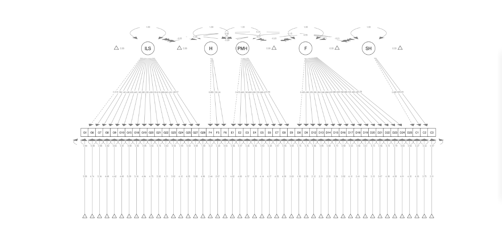

---

### Task 4. Correlation matrix
#### In this task we observe correlation between our variables. We will see what impact variables have on each other. In addition to correlation, author in his work also computes p significance. To do this we will use custom function.


```
corstarsl <- function(x){ 
  require(Hmisc) 
  x <- as.matrix(x) 
  R <- rcorr(x)$r 
  p <- rcorr(x)$P 
  
  ## define notions for significance levels; spacing is important.
  mystars <- ifelse(p < .001, "** ", ifelse(p < .01, "** ", ifelse(p < .05, "* ", " ")))
  
  ## trunctuate the matrix that holds the correlations to two decimal
  R <- format(round(cbind(rep(-1.11, ncol(x)), R), 2))[,-1] 
  
  ## build a new matrix that includes the correlations with their apropriate stars 
  Rnew <- matrix(paste(R, mystars, sep=""), ncol=ncol(x)) 
  diag(Rnew) <- paste(diag(R), " ", sep="") 
  rownames(Rnew) <- colnames(x) 
  colnames(Rnew) <- paste(colnames(x), "", sep="") 
  
  ## remove upper triangle
  Rnew <- as.matrix(Rnew)
  Rnew[upper.tri(Rnew, diag = TRUE)] <- ""
  Rnew <- as.data.frame(Rnew) 
  
  ## remove last column and return the matrix (which is now a data frame)
  Rnew <- cbind(Rnew[1:length(Rnew)-1])
  return(Rnew) 
}

corstarsl(total.total)
corstarsl(total.indonesia)
corstarsl(total.malaysia)
corstarsl(total.thailand)

```

---

|       Total                       |Positive Mental Health| Subjective Happiness| Forgiveness| Humility
|---------------------------------	| -------------------- |---------------------|------------|---------|
|Positive Mental Health
|Subjective Happiness                              |0.48** |                      |            |
|Forgiveness                                       |0.16** |             -0.09**  |            |
|Humility                                          |-0.18**|            -0.25**   |   0.28**   |
|Information Literacy Self Efficacy                |0.39** |              0.25**  |     0.04   |-0.14**

---


|       Indonesia                   |Positive Mental Health| Subjective Happiness| Forgiveness| Humility
|---------------------------------	| -------------------- |---------------------|------------|---------|
|Positive Mental Health
|Subjective Happiness                              |0.47** |                      |            |
|Forgiveness                                       |0.24** |               0.13*  |            |
|Humility                                          |-0.21**|            -0.15**   |   0.17**   |
|Information Literacy Self Efficacy                |0.44** |              0.29**  |     0.12*   |-0.16**


---


|       Malaysia                    |Positive Mental Health| Subjective Happiness| Forgiveness| Humility
|---------------------------------	| -------------------- |---------------------|------------|---------|
|Positive Mental Health
|Subjective Happiness                              |0.45** |                     |            |
|Forgiveness                                       |0.01   |               0.02  |            |
|Humility                                          |-0.23**|            -0.12*   |   -0.11    |
|Information Literacy Self Efficacy                |0.31** |              0.23** |     0.00   |-0.16**


---

|       Thailand                    |Positive Mental Health| Subjective Happiness| Forgiveness| Humility
|---------------------------------	| -------------------- |---------------------|------------|---------|
|Positive Mental Health
|Subjective Happiness                              |0.62** |                     |            |
|Forgiveness                                       |0.26** |             0.16**  |            |
|Humility                                          |-0.26**|            -0.25**  |     0.15** |
|Information Literacy Self Efficacy                |0.42** |             0.19**  |     0.15** |-0.07


---

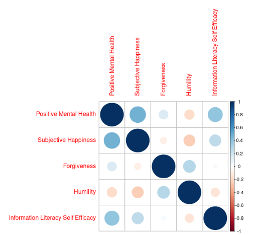      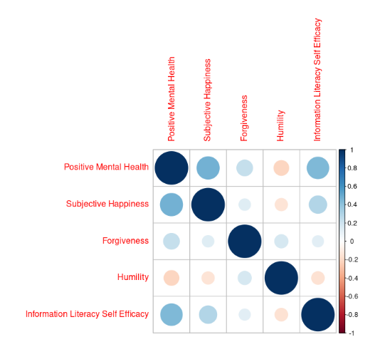

---

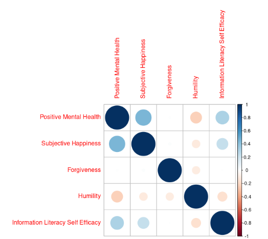      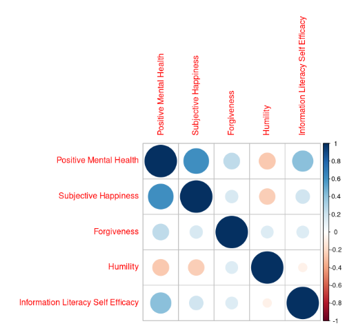

---

### Task 5. Regression analysis of variables
#### In this task we will do linear regression to determin the influence of subjective happiness, forgiveness, humility, and information literacy self-efficacy on mental health.

```
fit <- lm(`Positive Mental Health` ~ `Subjective Happiness` + Forgiveness + Humility + `Information Literacy Self Efficacy`, data=total.total)
summary(fit)

```
---

Residuals:
    Min      1Q  Median      3Q     Max 
-17.659  -2.569  -0.097   2.708  17.959 

Residual standard error: 4.562 on 964 degrees of freedom
Multiple R-squared:  0.3495,	Adjusted R-squared:  0.3468 
F-statistic: 129.5 on 4 and 964 DF,  p-value: < 2.2e-16


|     Coeficients                    |  Estimate |Std. Error| t value| Pr(>t)
|---------------------------------	 | ----------|----------|--------|--------|
|(Intercept)                         |  8.07221  |  1.62240 |  4.975 | 7.71e-07 ***
|Subjective Happiness                |  0.63746  |  0.04366 | 14.601 |  < 2e-16 ***
|Forgiveness                         |  0.08666  |  0.01101 |  7.868 | 9.63e-15 ***
|Humility                            | -0.17141  |  0.04669 | -3.672 | 0.000254 ***
|Information Literacy Self Efficacy  |  0.18780  |  0.01890 |  9.938 |  < 2e-16 ***


---

---

### Task 6. Kruskal Wallis test
#### The Kruskal–Wallis test is a non-parametric method for testing whether samples originate from the same distribution.It is used for comparing two or more independent samples of equal or different sample sizes.Non-parametric means that the test doesn’t assume our data comes from a particular distribution.
####    H0: population medians are equal.
####    H1: population medians are not equal.
#### The Kruskal Wallis test will tell you if there is a significant difference between groups. However, it won’t tell you which groups are different. The Kruskal Wallis test uses ranks instead of actual data. Rank references the position of the value in the sorted vector and is in the same order as the original sequence

```

columns <- c("Etotal","Ctotal","Dtotal","Ftotal","Gtotal", "country")
total.total <- total[ ,columns]
colnames(total.total) <- c ("Positive Mental Health", "Subjective Happiness", "Forgiveness", "Humility", "Information Literacy Self Efficacy", "Country")
kruskal(total.total$`Positive Mental Health`, total.total$Country,console = T)
kruskal(total.total$`Subjective Happiness`, total.total$Country,console = T)
kruskal(total.total$`Forgiveness`, total.total$Country,console = T)
kruskal(total.total$`Humility`, total.total$Country,console = T)
kruskal(total.total$`Information Literacy Self Efficacy`, total.total$Country,console = T)
kruskal.test(`Positive Mental Health` ~ Country, data=total.total)
dunnTest(total.total$`Positive Mental Health`,total.total$Country, method = "bonferroni")

```


---

|Variables                        |           Country            |                               Mean rank|  N    |  df |  Sig
|---------------------------------|------------------------------| -------------------------------------- | ----- | --- | -----|
|Positive Mental Health           |           Indonesia          |                              533.3958  |  331  |   2 |  .000
|                                 |           Malaysia           |                             493.0391   |  320  |     |
|                                 |           Thailand           |                               426.5362 |  318  |     |
|                                 |                              |                                        |       |     |
|Subjective Happiness             |           Indonesia          |                               418.4320 |  331  |   2 |  .000
|                                 |           Malaysia           |                               619.2328 |  320  |     |
|                                 |           Thailand           |                               419.2123 |  318  |     |
|                                 |                              |                                        |       |     |
|Forgiveness                      |           Indonesia          |                               634.6390 |  331  |   2 |  .000
|                                 |           Malaysia           |                               241.0062 |  320  |     |
|                                 |           Thailand           |                               574.7720 | 318   |     |
|                                 |                              |                                        |       |     |
|Humility                         |           Indonesia          |                               632.5831 |  331  |   2 |  .000
|                                 |           Malaysia           |                               351.5375 |  320  |     |
|                                 |           Thailand           |                               465.6855 |  318  |     |
|                                 |                              |                                        |       |     |
|Information Literacy Self Efficacy |         Indonesia          |                               466.0015 |  331  |   2 |  .000
|                                     |        Malaysia           |                               523.4344 |  320  |     |
|                                      |       Thailand           |                               466.0991 |  318  |     |


  

---


|            Comparison|        Z |     P.unadj  |      P.adj
|----------------------| -------- | -----------|-----------|
|1 Indonesia - Malaysia| 1.843117| 6.531193e-02| 1.959358e-01
|2 Indonesia - Thailand| 4.872563| 1.101598e-06| 3.304793e-06
|3  Malaysia - Thailand| 3.007166| 2.636954e-03| 7.910861e-03

---

